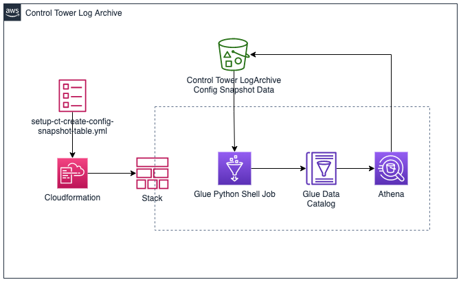

# Query Config Snapshots with Athena

This package creates a Glue Python Shell Job that will automatically generate a Glue table that can be used to query AWS Config Snapshot data stored in an S3 Bucket. This is useful for performing advanced queries of Config data using Amazon Athena.

This script uses the [AWS Data Wrangler](https://github.com/awslabs/aws-data-wrangler) package execute the Athena SQL statement that creates the table.
## Contents
- [Query Config Snapshots with Athena](#query-config-snapshots-with-athena)
  - [Contents](#contents)
  - [Functionality](#functionality)
    - [Table Definition](#table-definition)
  - [Prerequisites](#prerequisites)
  - [How it works](#how-it-works)
  - [Setup](#setup)


## Functionality

- The script runs a Glue Python Shell Job and generates a table in Glue that contains Config snapshot data.
- Config snapshot objects follow this prefix naming convention: `s3://[bucketname]/[optional-prefix]/AWSLogs/[accountId]/Config/[region]/YYYY/m/d/ConfigSnapshot/[snapshotName].json.gz`. A table is registered in the Glue data catalog with the Config Snapshot schema, and uses [partition projections](https://docs.aws.amazon.com/athena/latest/ug/partition-projection.html) to handle partitioning of the data. This enables the config data to be queried in-place.
- The Python script identifies the organization id, accounts and regions, then creates `enum` partition projections in the table properties for these values.
- A Glue Trigger, when activated, will execute the Glue Python Shell Job once every 12 hours to recreate the table - this is needed in to update the `enum` partition projects (i.e. if new accounts or regions begin sending data to the bucket)

### Table Definition

Below is the SQL statement that is used to generate the table. The `enum` value placeholders are populated by the script. 
```SQL
  CREATE EXTERNAL TABLE `:database_name;`.`:table_name;`
  (
    fileversion STRING,
    configSnapshotId STRING,
    configurationitems ARRAY < STRUCT <
        configurationItemVersion : STRING,
        configurationItemCaptureTime : STRING,
        configurationStateId : BIGINT,
        awsAccountId : STRING,
        configurationItemStatus : STRING,
        resourceType : STRING,
        resourceId : STRING,
        resourceName : STRING,
        relationships: ARRAY < STRING >,
        ARN : STRING,
        awsRegion : STRING,
        availabilityZone : STRING,
        configurationStateMd5Hash : STRING,
        configuration : STRING,
        supplementaryConfiguration : MAP < STRING, STRING >,
        tags: MAP < STRING, STRING >,
        resourceCreationTime : STRING
    > >      
  ) 
  PARTITIONED BY (
    `org` string,
    `account` string,
    `region` string,
    `date` string    
  ) 
  ROW FORMAT SERDE 'org.openx.data.jsonserde.JsonSerDe'
  LOCATION 's3://:bucket_name;/'
  TBLPROPERTIES
  (
    "projection.enabled" = "true",
    "projection.account.type" = "enum",
    "projection.account.values" = ":accounts;",
    "projection.region.type" = "enum",
    "projection.region.values" = ":regions;",
    "projection.org.type" = "enum",
    "projection.org.values" = ":orgs;",         
    "projection.date.format" = "yyyy/M/d",
    "projection.date.interval" = "1",
    "projection.date.interval.unit" = "DAYS",
    "projection.date.range" = ":begindate;,NOW",
    "projection.date.type" = "date", 
    "storage.location.template" = "s3://:bucket_name;/${org}/AWSLogs/${account}/Config/${region}/${date}/ConfigSnapshot"
  )
  ```


## Prerequisites
1. *AWS Control Tower with AWS Config Enabled*: The template and scripts assume that the Config Snapshot data is being stored in a bucket in the *Control Tower Log Archive* account. 

## How it works

The CloudFormation template used in the setup below creates the following resources:

* **Glue Python Shell Job**- This shell job contains a Python scripts that will perform the table creation.
    
* **Glue Database**- The database will be used to store metadata (i.e. table schemas) for for the Config snapshot data. This is primarily so we can perform queries in Athena later. 
    
* **S3 Bucket**- This bucket will store Python shell scripts. Glue Python Shell Jobs execute a Python script that is stored in S3. Additional Python libraries can also be loaded from .whl and .egg files located in S3. 
    
* **IAM Role for Glue Jobs**- Glue Jobs require an IAM role with permissions to access the resources they will interact with. 

The Python script used by Glue leverages the [AWS Data Wrangler](https://aws-data-wrangler.readthedocs.io/en/latest/what.html) library. This package extends the popular Pandas library to AWS services, making it easy to connect to, load, and save [Pandas](https://github.com/pandas-dev/pandas) dataframes with many AWS services, including S3, Glue, Redshift, EMR, Athena, and Cloudwatch Log Insights. In a few lines of code, the script performs the following steps:

1. Iterates prefixes in the Control Tower Logs bucket to find organization identifiers, account numbers, and regions associated with the data. 
2. Creates a table in the Glue Database with the Config snapshot data, using the organization identifiers, accounts, and regions as `enum` values in partition projections for the table. 

** Example Query**
An Athena saved query is created. The query is named `EC2InstanceSecurityGroupRelationships` and returns all EC2 instances and their associated security groups for every account and region that is sending Config snapshots to the Control Tower Bucket.


## Setup

**IMPORTANT**: This template is intended to be run in a Control Tower LogArchive account. It should also be run in the HOME region of Control Tower (i.e. the region where Control Tower log buckets are located).

1. Log into the Control Tower LogArchive account and going to the home region. 
2. Deploy the CloudFormation template, setup-generate_config_snapshot_table.yml. Optionally, specify the source bucket name. If you do not specify a name, the standard Control Tower logs bucket name `aws-controltower-logs-[accountid]-[region]`is used.

3. After the CloudFormation stack is created, go to outputs and click the link to the S3 bucket that the stack created.

4. Upload: awswrangler-2.5.0-py3-none-any.whl and ct_generate_config_snapshot_table.py

5. Go to the [AWS Glue console](https://console.aws.amazon.com/glue/home?region=us-east-1#etl:tab=jobs) and run the `ct-generate-config-snapshot-table` job.

6. Go to the [Glue Triggers Page](https://console.aws.amazon.com/glue/home?region=us-east-1#etl:tab=triggers). Select the `ct-generate-config-snapshot-table`, then click Action > Activate Trigger. The job will now run once every 12 hours to regenerate the table.

7. Go to the [Athena Saved Queries page](https://console.aws.amazon.com/athena/saved-queries/home) and select `EC2InstanceSecurityGroupRelationships`. The following query should be displayed:
    ```sql
        SELECT account,
                date,
                configurationItem.resourceId,
                configurationItem.resourceType,
                json_extract_scalar(relationship,
                '$.resourceid') related_resource, json_extract_scalar(relationship, '$.resourcetype') "related_type"
        FROM "aws_config_data"."aws_config_configuration_snapshot"
        CROSS JOIN UNNEST(configurationitems) AS t(configurationItem)
        CROSS JOIN UNNEST(configurationItem.relationships) AS t(relationship)
        WHERE region = 'us-east-1'
                AND date = date_format(current_date - interval '1' day, '%Y/%c/%e')
                AND configurationItem.resourceType = 'AWS::EC2::Instance'
                AND json_extract_scalar(relationship, '$.resourcetype') = 'AWS::EC2::SecurityGroup'
        ORDER BY  account, resourceid, related_resource 
    ```

    Execute the query. It should return a list EC2 instances and associated security groups for all AWS accounts and regions from *yesterday's* Config snapshot data.

    ```
